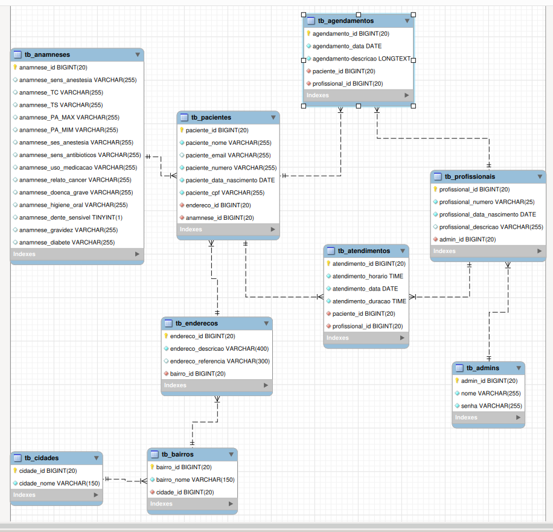

# Projeto de uma clinica em javaFX

## Ideia do projeto
A ideia aqui é basicamente um sistema onde apenas os proprietários e funcionários de uma clínica  possam utilizar o sistema. A aplicação vai servir para cadastrar pacientes, agendar consultas ou sessões entre pacientes e profissionais da saúde e também registrar os atendimentos e sessões feitas no estabelecimento.

## Breve introdução ao framework javaFx
O JavaFX é um conjunto de pacotes gráficos que permite aos desenvolvedores projetar, criar, testar, depurar e implantar aplicações que operam de maneira consistente em diversas plataformas. As interfaces gráficas são feitas em script FXML que é simples e também tem o SceneBuilder que permite edições dessas telas sem precisar utilizar código, facilitando o desenvolvimento da parte de interface com usuário. 

## Modelo lógico do banco de dados

    Seguindo a lógica de um sistema simples onde somente funcionarios acessam a aplicação, eu decidi fazer ele em um banco de dados local.
